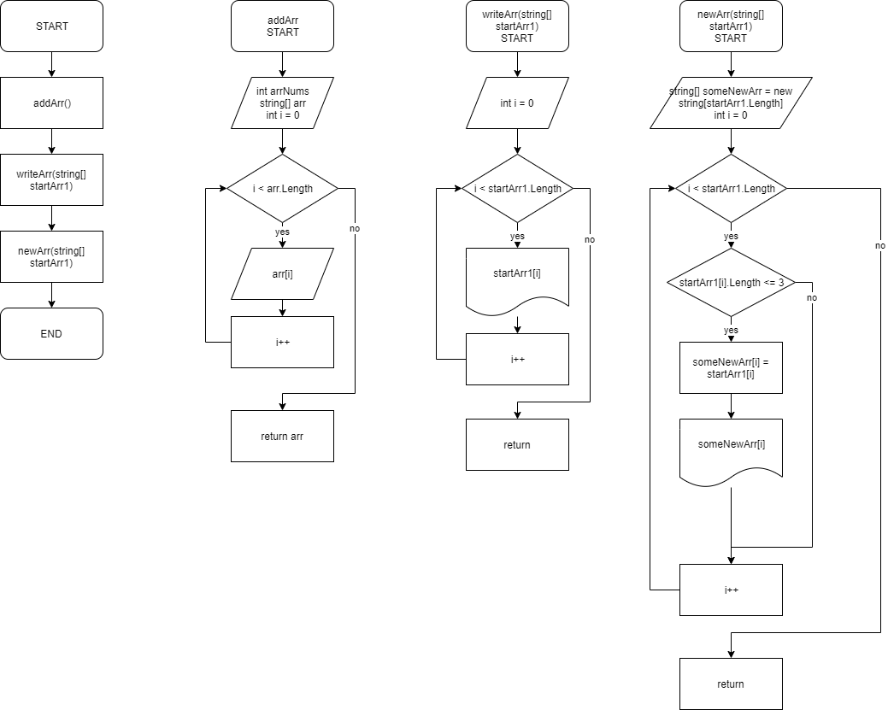

# Инструкция к коду задачи контрольной работы.

## Задание:
> Необходимо написать программу, которая из имеющегося массива строк формирует массив из строк, длина которых меньше или равна 3 символам.

## Блок-схема:

Вообще, реализовать её было нетрудно. Надо было расписать отдельно все функции. Можно запутаться, но в целом, *вроде понятно*.

## README.md

Это как раз то, что я пишу сейчас. Необходимо понятно объяснить, что и как я реализовал. Простая инструкция.

## Создание репозитория GitHub

Ожидаемо, проблем также не возникло. Аккаунт давно создан, нажато две кнопки и репозиторий готов.

## Непосредственно программный код

- **Функция создания массива**
    
    Функция сначала выводит на экран просьбу вписать пользователю количество элементов в будущем массиве, а потом и сами элементы. Реализовано всё через цикл for. От нулевого до введённого значения программа просит пользователя ввести поочередно все элементы.

- **Функция вывода массива**

    Данная функция также реализована через цикл for. От нулевого до значения длины массива выводятся элементы этого же массива.

- **Функция вычисления и вывода изменённого массива**

    Данная функция сначала создаёт новый массив с той же длиной, что и изначально введённый пользователем массив. Через цикл for проверяется, подходит ли элемент введённого массива под критерии "*меньше или равно 3 символам*". В случае, если подходит, то элемент присваевается на то же самое место в новом массиве, а после выводится на экран.

- **Объявление функций**

    Тут уж всё совсем легко. Просто объявляем поочерёдно три наших функции.

## А что если я не понимаю, что надо делать? Запустил программу, но что дальше-то..?
1. Сначала программа попросит вас ввести количество элементов в вашем будущем массиве. Можете не мелочиться, но не забывайте, что каждому нужно будет присвоить своё значение.
2. Далее программа попросит вас ввести значение каждому элементу вашего массива поочерёдно. Пишите в него, что хотите: буквы, цифры, другие знаки.
3. После этого наслаждайтесь результатом! Программа посмотрит ваш массив и выведет только те элементы массива, в которых содержится 3 или менее символа.